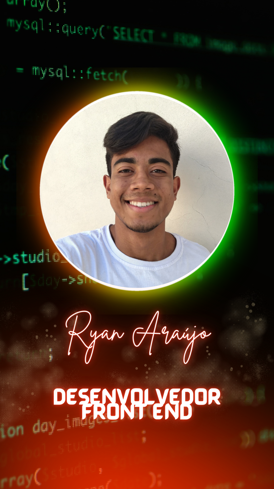

    <h1>Olá ! Sou  Ryan Araújo</h1>

- 👨‍ Software Developer 

<!-- - ▶️ I (not) regularly post videos on [youtube](link youtube) --> 

- 💬 Converse comigo sobre Idéias/Soluções

- 🌡️ Manso, Esforçado e Curioso

- 📆 20 anos

  
   
   

## 🛠 &nbsp;HardSkills

&nbsp;
&nbsp;
&nbsp;
&nbsp;
&nbsp;
&nbsp;
&nbsp;
&nbsp;

  
<!--

 
  
  
 
   
 

-->

